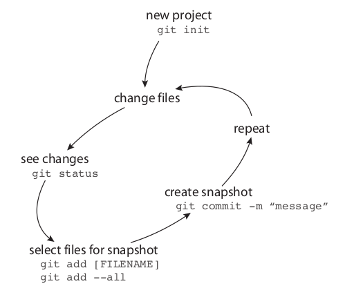
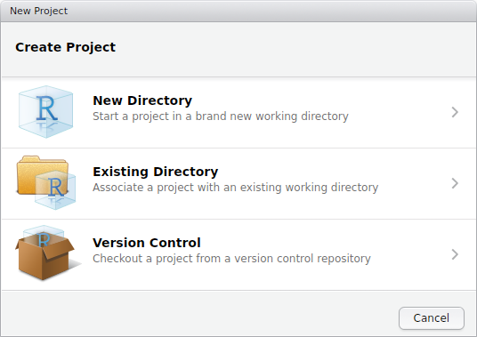

## Introducción a Git y GitHub

#### Requerimientos:

Para poder llevar a cabo esta clase necesitas tener instalado:

- R
- R studio
- git

Además necesitas tener una cuenta de github. 

#### ¿Qué vamos a ver durante la clase? 

1.  Breve introducción a los sistemas de control de versiones (VCS, por sus siglas en inglés). 

2.  SCV locales: Git.
  *   Comandos básicos de Git. 
  *   Flujo de trabajo. 
  *   Workflow. 
  *   Conceptos útiles para entender cómo funciona el programa.

3.  SCV remotos : Github
  *   Un par de comandos más en github. 
  *   Lo mínimo y suficiente para usar una cuenta.
  *   Hacer introducción a hello world!
  

4. Usando Github desde R studio.
  *   Clonar un repositorio desde R studio.

5.  Ventajas de usar Git y Github: reproducibilidad, organziación
 
### Sistemas de control de versiones

Los **VCS** son una herramienta para registrar y organizar cambios en una serie de archivos y directorios. Los VCS hacen una base de datos con el historial de versiones de un proyecto. Git y Github son ejemplos de VCS pero no son los únicos programas que permiten hacer un control de versiones (por ejemplo, [mercurial](https://www.mercurial-scm.org/about) o [Subversion](http://subversion.apache.org/)). 

### VCS locales: Git

[Git](https://gitforwindows.org/) es un VCS local con distribución en windows, mac y linux. Fue diseñado por Linus Trovalds para la creación de Linux y es de código abierto. 

Los archivos y directorios que están sujetos a un historial de versiones en git se guardan de forma **local**. En otras palabras, solo existen en tú computadora. Pero, ¿cómo funciona git?

Lo primero que hay que hacer en git es definir el directorio que estará sujeto a un historial de versiones, es decir un **repositorio** (¡¡¡Ding, ding ding!!! Concepto importante). 
¿Cuál es la forma más común de organizar un repositorio?
Aunque no hay un concenso es común encontrar repositorios que constan de cuatro directorios: 

- data
- scripts/bin
- figures
- meta

Además de esas carpetas los repositorios **siempre** tienen un archivo llamado **README**. El README file puede estar en fomrato markdown o en otros formatos pero siempre contiene la misma información. 
Algunos ejemplos de como se organizan los repositorios:
- [Phytools](https://github.com/liamrevell/phytools/)

Para que git sepa cuál es el repositorio que queremos tener bajo versión de controles se corre el comando `init`. Después se sigue un flujo de comandos que permite tener un buen seguimiento de las versiones que van cambiando con el tiempo. A continuación se presenta dicho flujo de trabajo:

1. **init:** `$ git init` 
     `Initilized empty Git repository in /rasgos_funcionales_github/.git` 
2. Realizar cambios en el repositorio: crear archivos nuevos, cambiar o editar archivos.
3. `$ git status` 
4. **add:**`$ git add [FILENAME]`: Agrega los archivos que quieres que git les siga la pista.
5. **commit:**`$ git commit -m "mensaje sobre los cambios"`: Después de modificar un archivo hay que dejar un mensaje claro y preciso sobre las modificaciones realizadas a un archivo.
6. Repetir a partir del punto 2.

Otro par de comandos (también pueden ser vistos como conceptos) centrales en git son `branch` y `merge`. `branch` crea una copia del repositorio principal (**master** branch) para realizar cambios que no comprometen el repositorio principal o la **master** branch. Al crear una rama que sale de la rama principal es importante elegir un nombre para la rama que refleje los objetivos que se planean mejorar de la **master** branch. Se realizan cambios en la `branch secundaria` y se hacen `commit` de la misma forma que se realizarían en la `master` branch. Una vez que logramos el objetivo se hace un `merge` de la `branch scundaria` con la **master** branch.

Si nos fijamos en el logotipo de git podemos ver la importancia de un  `branch` en el control de versiones. 

Esto podría parecer tedioso. Aprender los comandos y repetirlo podría quitar mucho tiempo.... ¿cuáles serían las ventajas de utilizar git? 

Enlistar las ventajas

### VCS remotos: Github

Es un sitio web para trabajar y colaborar en proyectos que están sujetos a control de versiones basado en **git** y que guarda los repositorios en la red.
Con el flujo de trabajo de git y entendiedo que es un `commit` y que es un `branch` ahora hay que agregar unos conceptos extras claves en github:

1. **fork**: cuando creas una copia de repositorio en tu cuenta de github a partir de otra cuenta de github.  
2. **clone**: baja el repositorio remoto a tu cuenta local.
3. **pull**: bajas la última versión de un repositorio remoto y se incorporan los cambios con tu repositorio local. 
4. **push**: envias los cambios y comitts del repositorio local al repositorio reomoto u _online_. Esto solo funciona si tu eres dueño del repositorio remoto, de lo contrario se debe de hacer un `pull request`.
5. **pull request**: si tu no eres propietario de un repositorio remoto debes de subir tus cambios como sugerencia de cambio. Tu no haces el `push`, sino que sugieres al autor que haga un `pull` de tus cambios. Una vez que el propietario del repositorio ha revisado y aceptado los cambios, fusiona las ramas con un `merge`.

Ahora que ya sabemos un poco sobre git y github hagamos nuestra primer actividad en github. Ve a la [intro: hello-world](https://guides.github.com/activities/hello-world/) de github. Leela con cuidado, has los pasos del ejercicio y nos vemos en 10 minutos.

Buena guía del [workflow](https://guides.github.com/introduction/flow/)

El proceso general de trabajar en repositorios remotos es:

**Pull** > Hacer cambios > **Add** > **Commit** > **Push** > Repeat

### Usando Github desde R studio.

Ahora trataremos de hacer un repositorio usando R studio. Vamos a intentar clonar el repositorio que contiene a este archivo. Antes de clonarlo hay que hacer un `fork`. 

1. Ve a la base del repositorio y busca la pestaña que dice `Fork`:

2. Después de tener una copia del repositorio en tú cuenta ahora hay que hacer una copia local utilizando R studio. Busca el botón verde que dice `Code`. Copia el url del repositorio y ve a R studio.

3. En R studio ve a File y selecciona New Project. 

4. Selecciona la opción de Version control.

5. Slecciona la opción Git.

6. Agrega el url que copiamos de la página de Git. Además selecciona el directorio donde quieres que viva el repositorio local en tu computadora. 

Si los pasos previos salieron bien estás listo para hacer una contribución a un repositorio clonado. 

`## install if needed (do this exactly once)` 
`## install.packages("usethis")`
`library(usethis)`
`use_git_config(user.name = "Jane Doe", user.email = "jane@example.org") `
