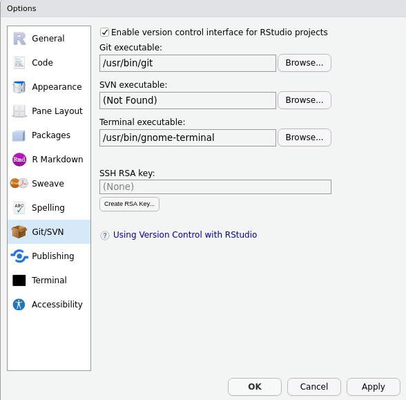
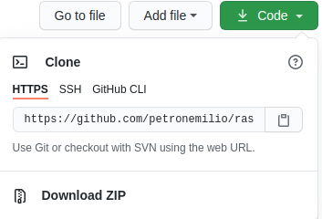
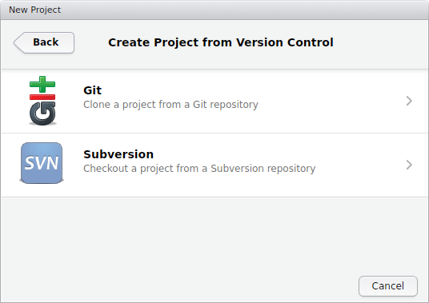

## Introducción a Git y GitHub

#### Requerimientos:

Para poder llevar a cabo esta clase necesitas tener instalado:

- [R](https://cran.r-project.org/)
- [R studio](https://rstudio.com/)
- [git](https://git-scm.com/downloads)

Además necesitas tener una cuenta de [github](https://github.com/). 

#### ¿Qué vamos a ver durante la clase? 

1.  Breve introducción a los sistemas de control de versiones (VCS, por sus siglas en inglés). 

2.  SCV locales: Git.
    * Repositorios y su organización.
    * Comandos básicos y flujo de trabajo. 
    * `Branch` y `merge`: conceptos útiles para entender cómo funciona el programa.

3.  SCV remotos : Github
    * ¿Qué es github y cómo uso una cuenta?
    * Un par de comandos más en github. 
    * Hacer introducción con hello world!
  
4.  Ventajas de usar Git y Github: reproducibilidad, organziación.

5. Usando Github desde R studio.
    * Configura tu cuenta de git en la computadora desde R studio.
    * Clonar un repositorio desde R studio.


### Sistemas de control de versiones

Los **VCS** son una herramienta para registrar y organizar cambios en una serie de archivos y directorios. Los VCS hacen una base de datos del historial de versiones de un proyecto. Git y Github son ejemplos de VCS pero no son los únicos programas que permiten hacer un control de versiones (por ejemplo, [mercurial](https://www.mercurial-scm.org/about) o [Subversion](http://subversion.apache.org/)). 

### VCS locales: Git

[Git](https://gitforwindows.org/) es un VCS local con distribución en windows, mac y linux. Fue diseñado por Linus Trovalds para la creación de Linux y es de código abierto. 


Los archivos y directorios que están sujetos a un historial de versiones en git se guardan de forma **local**. En otras palabras, solo existen en tú computadora. Pero, ¿cómo funciona git?

#### Repositorios y su organización.

Lo primero que hay que hacer en git es definir el directorio que estará sujeto a un historial de versiones, es decir un **repositorio** (¡¡¡Ding, ding ding!!! Concepto importante). 
¿Cuál es la forma más común de organizar un repositorio?
Aunque no hay un concenso es común encontrar repositorios que constan de cuatro directorios: 

- **data**
- **scripts/bin**
- **figures**
- **meta**

Además de esas carpetas los repositorios **siempre** tienen un archivo llamado **README**. El **README** file puede estar en formato [markdown](https://www.markdownguide.org/getting-started/) o en otros formatos pero siempre contiene la misma información. ¿Cuál es esa información? 

Algunos ejemplos de como se organizan los repositorios:

- [Phytools](https://github.com/liamrevell/phytools/)
- [detectionfilter](https://github.com/TobiasRoth/detectionfilter)
- [taxize](https://github.com/ropensci/taxize)

#### Comandos básicos y flujo de trabajo. 

Para que git sepa cuál es el repositorio que queremos tener bajo control de versiones se corre el comando `init`. Después se sigue un flujo de comandos que permite tener un buen seguimiento de las versiones que van cambiando con el tiempo. A continuación se presenta dicho flujo de trabajo:

1. **init:** `$ git init` 
     `Initilized empty Git repository in /rasgos_funcionales_github/.git` 
2. Realizar cambios en el repositorio: crear archivos nuevos, cambiar o editar archivos.
3. `$ git status` 
4. **add:**`$ git add [FILENAME]`: Agrega los archivos que quieres que git les siga la pista.
5. **commit:**`$ git commit -m "mensaje sobre los cambios"`: Después de modificar un archivo hay que dejar un mensaje claro y preciso sobre las modificaciones realizadas a un archivo.
6. Repetir a partir del punto 2.


#### `Branch` y `merge`: conceptos útiles para entender cómo funciona el programa.

Otro par de comandos (también pueden ser vistos como conceptos) centrales en git son `branch` y `merge`. `branch` crea una copia del repositorio principal (**master** branch) para realizar cambios que no comprometen el repositorio principal o la **master** branch. Al crear una rama que sale de la rama principal es importante elegir un nombre para la rama que refleje los objetivos que se planean mejorar de la **master** branch. Se realizan cambios en la `branch secundaria` y se hacen `commit` de la misma forma que se realizarían en la `master` branch. Una vez que logramos el objetivo por el cuál se creo la rama secundaria, se hace un `merge` de la `branch scundaria` con la **master** branch.

Un esquema del proceso de hacer branches se ilustra en el siguiente esquema:

](../meta/branches.png)

Git es un buen programa para detectar los cambios en las diferentes `branches` y dejar una versión final al hacer un `merge` de las diferentes versiones del repositorio. ¿Qué pasaría si haces un branch y haces el mismo cambio en la misma línea de la `master` branch y de una `secundaria`? 


Los branches permiten la colaboración de mucha gente en un proyecto. Los `branches` son muy importantes en el mantra de git y se refleja en el logotipo del programa. 


### VCS remotos: Github

#### ¿Qué es github y como uso una cuenta?
Es un sitio web para trabajar y colaborar en proyectos que están sujetos a control de versiones basado en **git** y que guarda los repositorios en la red. También es una especie de red social de código. La gente puede ver tu perfil y tus repositorios y tú puedes ver el perfil de otros usuarios. 

Con el flujo de trabajo de git y entendiedo que es un `commit` y que es un `branch` ahora hay que agregar unos conceptos extras claves en github:

1. **fork**: cuando creas una copia de un repositorio en tu cuenta de github a partir de otra cuenta de github. Más documentación del `fork` en [github](https://docs.github.com/en/enterprise-server@2.20/github/getting-started-with-github/fork-a-repo#fork-an-example-repository)  
2. **clone**: baja el repositorio remoto a tu cuenta local.
3. **pull**: baja la última versión de un repositorio remoto y se incorporan los cambios con tu repositorio local. 
4. **push**: envias los cambios y commits del repositorio local al repositorio reomoto u _online_. Esto solo funciona si tu eres dueño del repositorio remoto, de lo contrario se debe de hacer un `pull request`.
5. **pull request**: si tu no eres propietario de un repositorio remoto debes de subir tus cambios como sugerencia de cambio. Tu no haces el `push`, sino que sugieres al autor que haga un `pull` de tus cambios. Una vez que el propietario del repositorio ha revisado y aceptado los cambios, fusiona las ramas con un `merge`.

#### Hacer introducción con hello world!

Ahora que ya sabemos un poco sobre git y github hagamos nuestra primer actividad en github. Ve a la [intro: hello-world](https://guides.github.com/activities/hello-world/) de github. Leela con cuidado, haz los pasos del ejercicio y nos vemos en 10 minutos.

El proceso general de trabajar en repositorios remotos personales:

**Pull** > **Hacer cambios** > **Add** > **Commit** > **Push** > **Repeat**
                                           
¿Cómo sería el proceso de cambiar un repositorio __forkeado__ para que el dueño realice los cambios?          
Otras guías que te pueden ayudar a entender como funciona github las encuentras en las siguientes ligas:

- Buena guía del [workflow](https://guides.github.com/introduction/flow/)
- Juego de [branches](https://learngitbranching.js.org/?locale=es_AR). 


### Ventajas de usar Git y Github

Aprender y ejecutar los comandos y repetirlo podría quitar mucho tiempo. Manejar muchas `branches` no parece ser algo muy práctico. Entonces, ¿cuáles serían las ventajas de utilizar git y github?

- Permite organizar mejor tus proyectos.


- Puedes recuperar versiones de repositorios completos pasados.

- Te fuerza a compartir tu código y eso al final hace que la ciencia sea más abierta y reproducible.

- Manejar mejor la solución de problemas en un código al trabajar de forma colaborativa.

- Tener experiencia en github es un muy buen elemento curricular.


### Usando Github desde R studio.

#### Preparación inicial

Ahora trataremos de hacer un repositorio usando R studio. Antes de clonar el repositorio es importante configurar git en tu computadora. Esto se puede hacer de varias formas:

1. Si tienes familiaridad con la terminal (Mac, Linux) abre una terminal y escribe:
``` bash
git config --global user.name "petronemilio"
git config --global user.email "emilio.petrone@st.ib.unam.mx"
```
También puedes abrir una terminal desde R studio y correr los comandos del paso 1.

2. Otra opción es correr en el prompt de R o en un script los siguientes comandos:
``` R
    ## install if needed (do this exactly once) 
    install.packages("usethis")
    library(usethis)
    use_git_config(user.name = "petronemilio", user.email = "emilio.petrone@st.ib.unam.mx")
```  

Ahora hay que decirle a R studio donde está el ejecutable de Git. Ve a `Tools`> `Global Options`. Se abrirá un cuadro de diálogo que dice **Options** y vayan a la opción de Git/SVN. 



Reinicia tu R studio para que todo este listo.

#### Clonación de un repositorio desde R studio

Después de esto vamos a intentar clonar el repositorio que contiene a este archivo. Antes de clonarlo hay que hacer un `fork`. 

1. Ve a la base del repositorio y busca la pestaña que dice `Fork`:


2. Después de tener una copia del repositorio en tú cuenta ahora hay que hacer una copia local utilizando R studio. Busca el botón verde que dice `Code`. Copia el url del repositorio y ve a R studio.



3. En R studio ve a File y selecciona New Project. 


4. Selecciona la opción de Version control.



5. Slecciona la opción Git.

6. Agrega el url que copiamos de la página de Git. Además selecciona el directorio donde quieres que viva el repositorio local en tu computadora. 


Si los pasos previos salieron bien estás listo para hacer una contribución a un repositorio clonado. 

#### Primera exploración de la base.

En la siguiente sección el objetivo es entender las opciones que R studio y git nos ofrecen para modificar y ver nuestros repositorios.
Si abres un repositorio desde R studio podemos ver las carpetas que componen al repositorio. También podemos abrir los archivos y modificarlos. Si modifico uno de los archivos del repositorio, ¿veríamos los cambios en el repositorio en github?

Exploremos un poco las pestañas y opciones que r studio y git tienen para ofrecernos.

Para concluir la clase, abre el script `exploration_script.R` que se encuentra dentro de la carpeta scripts.

Verás que hay un par de cosas por resolver. Encuentra las soluciones con el código de R apropiado y has un `pull request` para que se modifique el script que se encuentra en github.

Si quieres ver más información de git, github y R studio te dejo un para de ligas con más información:

- [Jenny Bryan tutorial](https://happygitwithr.com/)
- [R chapter](https://r-pkgs.org/git.html)
